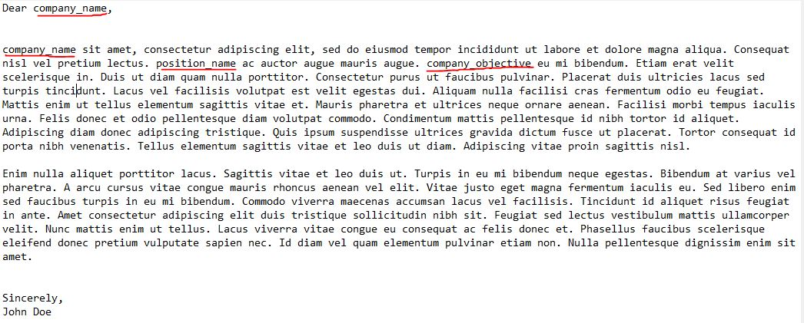
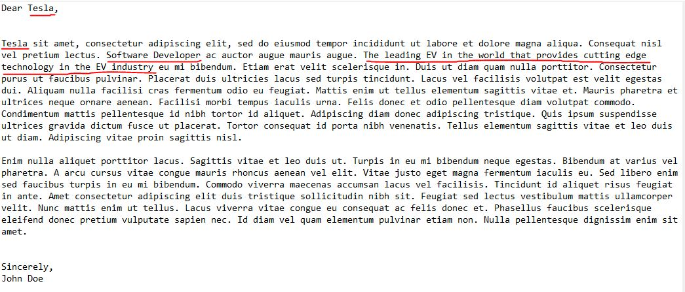

# java-cover-letter-automation

Created an automation Java program that takes in a docx cover letter file and replaces variables such as company_name, position_name, and company_objective in a cover letter template file. After automating, it prints out a PDF result in a specific path name of my choosing with the name of the company. With a batch file, I'm able to call the program with a simple click.
Here's a picture of before and after results:
<picture>
  
</picture>
<picture>
  
</picture>
